# Agent Operating Contract

> **Operating contract for autonomous agents working in this repository.**
>
> This contract applies to every CLI agent operating against the Aragora codebase: Claude Code, Codex CLI, Factory Droid, Aider, the agent-bridge harnesses, and any future addition. It defines what each agent may do autonomously, what requires approval, and how to behave when the dev loop is at risk.
>
> **Provenance.** Originally drafted as the *Foundation-Hardening v2* spec by Factory Droid on 2026-04-25 after a Codex review of v1. Ratified into the canonical doc chain on 2026-04-28 so non-Factory agents can find and follow it.
>
> **Position in the canonical chain.** This is *operational* — it tells agents *how* to execute against the canonical roadmap. The *what* and *why* live in [`docs/THESIS.md`](THESIS.md) → [`docs/CANONICAL_GOALS.md`](CANONICAL_GOALS.md) → [`docs/plans/ARAGORA_EVOLUTION_ROADMAP.md`](plans/ARAGORA_EVOLUTION_ROADMAP.md) → [`docs/status/NEXT_STEPS_CANONICAL.md`](status/NEXT_STEPS_CANONICAL.md). When this contract conflicts with the canonical chain, the canonical chain wins.

---

## Material changes from v1

1. Wave 0 has stricter exit gate; #6577 needs substance fix or close
2. "Break X freely" reformulated to protect main + public surface + tools
3. Workflow/runner/CI/release changes are now **tool changes** requiring approval
4. Wave 1 is reframed as **floor alignment** (paperwork) before any actual upgrade
5. Pre-Wave 4 audit PR: read-only route map before deletions
6. New "main red" incident mode

---

## Operating contract v2

### Always-allowed (autonomous)
- Code refactors with same/improved tests
- Test additions and consolidations
- Doc reconciliation that does not change governance, approval, merge, evidence,
  settlement, or release authority
- Dep floor **alignment** (raising `ci_install_project.sh` floors to match `pyproject.toml`)
- Dep floor **patch-level** bumps (`X.Y.Z` → `X.Y.Z+n`)
- Removing deprecation shims past their stated removal version
- Read-only audit PRs (mapping, dependency graphs, dead-code reports)
- New PRs: max 1 active per wave; wait for CI before next within same wave

### Approval-required (will pause and ask)
- **Tool changes** — anything that touches the dev/release loop:
  - GitHub Actions workflows
  - Runner labels or fleet config
  - Required-check matrix
  - Secret/auth setup
  - Pre-commit/pre-push hooks
  - Release workflows (tag/release.yml, publish.yml)
  - Merge-quorum, model-evidence, human-settlement, or branch-protection helper
    behavior
- **Major-version dep bumps** (`X.0` → `X+1.0`)
- **Public API/SDK surface changes** — removing CLI commands, REST endpoints, SDK methods
- **Schema migrations** that drop columns or rename tables
- **Branch deletion** with unmerged commits
- `git push --force` to any branch
- Touching governance or merge-authority docs: `docs/AGENT_OPERATING_CONTRACT.md`,
  `docs/REVIEW_AUTHORITY_PRINCIPLES.md`, `CLAUDE.md`, or `AGENTS.md`
- Touching `scripts/nomic_loop.py`, `.env`, `secrets/`
- Anything taking >1 CI cycle to validate

### "Break X" rule (revised from v1)

> **Break unreleased branch behavior freely; never break main, public API/SDK, release flow, website, or CI.**

The dev loop is the means by which the codebase is improved. Break **branches** (where reverts are free), not the **dev loop** (where breakage compounds).

Concretely:
- **Free to break:** PR-branch behavior, internal-only modules, experimental features, docs in flight
- **Not free to break:** `main`, the SDK public API, REST API contracts, the release workflow, deployment scripts, the test runner, the CI matrix, the runner fleet, the website (`docs-site/`)

### Auto-halt triggers (expanded)

1. **MAIN RED INCIDENT MODE** — any required check on `origin/main` fails for >30 min:
   - Halt all roadmap PR work immediately
   - Bisect and fix priority #1
   - Resume only when main green for ≥1h OR user explicitly waives
   - Clearly mark all paused PRs in the wave-tracking comment
2. Two consecutive PRs in the same wave fail CI for distinct reasons → stop the wave, ask
3. A dep bump introduces >5 transitive dep changes → pause, ask
4. A consolidation PR exceeds 800 LOC delta → split before pushing
5. Pre-commit hook starts failing for unrelated files → fix the hook before continuing
6. The runner fleet drops below 3 healthy runners labeled `aragora` → pause workflow changes, alert

### Per-PR discipline (unchanged)
- Clear title + body with risk + verification + wave reference
- Each PR runs full local test suite (or relevant slice) before push
- Each PR scope ≤800 LOC delta (excluding generated files)
- Each PR includes `Co-authored-by: <agent-name>[bot]` trailer (e.g. `factory-droid[bot]`, `claude[bot]`, `codex[bot]`)

### §Conductor — autonomous PR-advancing loops (evidence-last, anti-molasses)

This section is the **single source of truth** for any recursive/long-running loop that
advances PRs through the merge-quorum gate (Codex conductors, `elves-aragora` batches,
boss-loop ticks). Recursive prompts MUST **reference this section by name** instead of
re-embedding its rules: carry forward only the current exact-head **target + one next
action**, never a copy of these invariants. Copying invariants per-cycle burns tokens and
drifts (a self-replicating prompt mutates); a pointer does not. Use the thin template below.

**Precedence and scope.** This subsection narrows how already-selected PRs advance through
review, evidence, and merge-quorum. It does **not** weaken the rest of this operating
contract: Approval-required items, Auto-halt triggers, the canonical chain, and Tier 3/4
human-settlement requirements remain hard stops. If any of those floors fire, pause the loop
even when the current PR otherwise looks like Tier 0-2 work. The human-facing worker
assignment / integration cadence in [`docs/guides/CONDUCTOR_WORKFLOW.md`](guides/CONDUCTOR_WORKFLOW.md)
is separate: that guide governs selecting and coordinating worker lanes; this section governs
advancing a chosen PR through model evidence and merge-quorum. This section also does **not**
grant merge authority by itself: merge remains governed by the relevant helper verdict,
branch protection, and any run-level "never merge by default" rule.
Edits to this operating contract, `docs/REVIEW_AUTHORITY_PRINCIPLES.md`, or code that changes
merge/evidence/settlement authority are merge-authority self-modification: classify them as
Tier 4 and stop for exact-head human risk settlement before any merge/protection mutation,
even when the file diff is Markdown-only. Edits to §Conductor itself (or any merge-authority
governance) are Tier 4 — they require human risk settlement, not Tier 0-2 auto-merge — by the
same rule above.

**Autonomy rail — the anti-molasses rule.** Run continuously through bounded units **without
asking the operator**, as long as every unit stays on Tier 0-2 rails as defined by
[`docs/REVIEW_AUTHORITY_PRINCIPLES.md`](REVIEW_AUTHORITY_PRINCIPLES.md) and makes *external*
progress (a posted-and-counted evidence comment, a repair commit that clears a finding, a real
archive, or a merge only when a separate merge-on-green preference / helper authorization
already permits it). Touch the operator **only** at (a) a genuine Tier 3/4 risk decision, or
(b) a circuit-breaker halt. Do **not** insert a human checkpoint between safe, progressing units
— that is the molasses failure mode. "One bounded unit, then stop and ask" is WRONG unless the
next unit is Tier 3/4 or the breaker tripped. This rail does not override an existing
batch/lane gate-attempt cap: after the allowed revise-and-retry budget is exhausted, park or
halt that lane and move only to a different unblocked Tier 0-2 unit.

**EVIDENCE-LAST (settlement-stability).** A head is *settlement-stable* iff every checkable
signal below holds: (1) the latest adversarial **dry-run** review was clean for the **current**
head (no CHANGES-REQUESTED / `[P0]` / `[P1]` / `[P2]` from every family that will be counted for
this Tier); (2) no commit has landed since — `headRefOid` still equals the head that was
reviewed; (3) every branch-protection required check **other than** the exact quorum /
human-settlement context being satisfied by this evidence/settlement step is green, with no
non-quorum required check pending, failing, or cancelled; AND (4) the PR is mergeable — not
behind base and free of conflicts — with the PR non-draft and GitHub reporting `mergeable` as
`MERGEABLE` and `mergeStateStatus` as `CLEAN` or `BLOCKED`; `UNSTABLE` is also permitted only
when merge-packet has an available, selected required-check surface with at least one effective
required check, every required check green, and complete rollup diagnostics proving every
non-green context is non-required. Required-check gating comes from `gh pr checks --required` /
merge-packet's required-check surface, not the raw `statusCheckRollup`: non-required rollup
failures remain advisory, but any failing non-quorum required check makes the head not
settlement-stable. Do not add a "base unchanged" condition
that depends on a `baseRefOid` / base-OID freeze the helper does not record (the `BEHIND` /
`DIRTY` exclusion below already rejects a head that drifted behind or conflicts with its base).
"Clean" is a
semantic/body-marker requirement, not only the helper's `verdict`, `would_count`, or
`has_supportive_quorum` fields: a `Verdict: PASS` body that still contains a concrete
`[P0]`, `[P1]`, or `[P2]` finding is not clean and must become a repair packet, not countable
support. `BLOCKED` is allowed only when the blocker is the quorum / exact-head human-settlement
context this step is designed to satisfy; `BLOCKED` from any other required check failure is
not settlement-stable. `DIRTY`, `BEHIND`, `DRAFT`, `UNKNOWN`, unproven `UNSTABLE`, and
missing/unknown mergeability or `mergeStateStatus` are not settlement-stable. The
counted-family set comes from
[`docs/REVIEW_AUTHORITY_PRINCIPLES.md`](REVIEW_AUTHORITY_PRINCIPLES.md), especially the
Tier-eligibility table; do not invent a smaller family set inside a recursive prompt.
**Never collect countable (`--apply`) evidence on a head that is not settlement-stable.**
Loop: dry-run → if findings, repair → dry-run → … → clean → freeze exact head → collect ONCE
→ settle. Settlement head movement is almost entirely review-driven and thus predictable: if
the dry-run has findings, the head WILL move next, so do not spend on countable evidence yet.

**Operational dry-run re-check.** The prepared-evidence artifact records the exact `head_sha`.
There is no separate "freeze proof" artifact and no `baseRefOid` / base-OID field in the
helper schema, so do not claim one exists or gate countable evidence on a recorded base OID;
re-verify the checkable settlement-stable signals against the live PR instead. The target
enforced interface is a JSON artifact from:

```bash
python3 scripts/collect_quorum_evidence.py --repo synaptent/aragora --pr <N> \
  --reviewers <families...> --json > /tmp/ev_<N>_dry.json
```

Before any `--apply`, verify the artifact records the live `head_sha`, `dissenting_families` is
empty, `has_supportive_quorum` is true, and each counted `items[].body` both lints for the
current PR/head and contains no concrete CHANGES-REQUESTED / `[P0]` / `[P1]` / `[P2]` finding.
Then re-check `gh pr checks --required <N>` (or the merge-packet required-check surface) and
`gh pr view <N> --json headRefOid,mergeable,mergeStateStatus,isDraft`: `headRefOid` must still
equal the artifact `head_sha`, `isDraft` must be false, every non-quorum required check must
be green, and `mergeable` / `mergeStateStatus` must still be in the settlement-stable set
above (a `BEHIND` or `DIRTY` state means the head has drifted relative to its base and is not
settlement-stable). Only then
run the paired apply from the same artifact:

```bash
python3 scripts/collect_quorum_evidence.py --repo synaptent/aragora --pr <N> \
  --prepared-json /tmp/ev_<N>_dry.json --apply --json
```

If a helper version does not yet record or enforce any of the live re-checks above, treat that
helper as prepare/report-only for countable evidence unless the missing live checks (head
unchanged, mergeable, non-draft) are performed against the live PR and reported immediately
before posting. The conductor may not claim the weaker `--apply` implementation enforced the
full rule; either perform and report the missing checks before posting the exact prepared
bodies, or wait for the enforcement tooling to land.

**Target state (enforcement is converging).** §Conductor is *normative*: it states the policy
loops must follow, ahead of full machine-enforcement. This contract PR disables automated
legacy direct apply (`auto_evidence_cycle.py --apply`) unless an explicit override is present;
it does not claim to finish the prepared-apply stability gate. Today some prepared-apply
clauses are enforced by discipline + review, not yet by tooling — e.g. the apply path
(`apply_prepared_evidence`) currently re-verifies head + tier but not the live `mergeable` /
`mergeStateStatus` / draft / required-check state. Evidence-lint treats concrete `[P0]`,
`[P1]`, and `[P2]` findings as blocking while preserving explicit non-finding heads such as
`[P2] None:`. A helper `would_count=true` result is still insufficient by itself: the
conductor must scan the exact prepared comment body for CHANGES-REQUESTED / `[P0]` / `[P1]` /
`[P2]` markers immediately before posting and treat any hit as dissent. Closing the remaining
prepared-apply live-state gaps is the job of the `collect_quorum_evidence`
settlement-stability gate follow-up; until then, prepared evidence posting is manual
exact-head operator work, not unattended conductor automation.

Migration note: re-scanning older `Verdict: PASS` evidence can de-count comments that include
concrete `[P2]` findings. That is intentional; repair the underlying P2 or collect fresh
exact-head evidence after the finding is resolved. Explicit non-finding heads such as
`[P2] None:` remain countable.

**Automation compatibility.** Existing collectors such as `scripts/auto_evidence_cycle.py`
remain evidence-posting tools, not authority to skip the dry-run/freeze rule. An automated
collector may post countable evidence only when it persists the dry-run artifact and replays
that exact artifact through a live-head/base/merge-state prepared-json apply. Collectors that
do not implement that sequence are prepare/report-only for countable evidence and must not be
used by conductor loops for countable posting. In particular, legacy direct apply via
`ARAGORA_AUTO_EVIDENCE=1` and `scripts/auto_evidence_cycle.py --apply` is disabled unless a
separate `ARAGORA_ALLOW_LEGACY_AUTO_EVIDENCE_APPLY=1` override is present. That override is an
explicit operator exception/reporting event, not settlement-stable conductor automation, and
must stay unset for conductor-compliant merge-arbiter launches until the path is converted to
prepared-artifact replay.

**NO-TREADMILL.** Batch all known findings into ONE repair per head; never
repair-then-recollect on the same head. Any CHANGES-REQUESTED / `[P0]` / `[P1]` / `[P2]` ends the
evidence lane and becomes a repair — never post partial or dissenting evidence.

**CIRCUIT-BREAKER + dead-letter ban.** If a loop produces no *external* progress for 3
consecutive cycles, HALT it and emit ONE operator escalation — do not spin. Never re-message
a stale/dead lane (stale heartbeat or `possible_unpushed_work`); mailing dead letters is
forbidden. A loop whose only output is "wrote one steering request" is **not** making
progress.

**ONE-CLAUDE (scarce-reviewer serialization).** Do not run a claude-family evidence lane
while a human-driven settlement/review is using the claude account; prefer openai/grok or
yield. The binding constraint is the reviewer account, not work supply.

**FIX-ENV-ONCE.** If commit/push needs `--no-verify` because the repo `.venv` lacks
`pre_commit`, fix it once (install the hook runtime) and stop bypassing hooks. Do not
normalize `--no-verify`.

**Shared root is read-only.** If the shared checkout is dirty or detached, report it and use a
disposable worktree for edits; never mutate shared-root dirt. A clean root that is merely
behind `origin/main` should be fast-forwarded as the conductor/integrator surface per
[`docs/guides/CONDUCTOR_WORKFLOW.md`](guides/CONDUCTOR_WORKFLOW.md); it still must not become
a worker implementation lane.

**Reporting honesty.** A merge performed under an explicit operator override (e.g. a
Dependabot/Tier-3 merge the operator authorized at an exact head) is reported as "merged
under explicit operator override", never as "the helper said it was safe".

#### Per-object locks (single-conductor rule scope)

The single-conductor rule prevents two lanes mutating the **same object**; it is not a
global mutex on running processes. Locks are scoped by object type:

- **Branch work** — a `scripts/check_work_lease.py` claim on the branch.
- **PR settlement** — a conductor ownership declaration on the PR/issue.
- **Harvest items** (issue #8993 protocol) — a claim comment on the issue: claim first,
  then execute; on a race, the later claim timestamp yields.

A sighted goal-cycle/consult process elsewhere is **not** a collision absent a conflicting
claim or lease on the same object; standing down on process sightings alone is the
false-collision failure mode (observed 2026-07-08 as a three-cycle false breaker).

#### Thin recursive-prompt template (carry this shape forward, not the rules)

Goal preambles handed to lanes should include the wrong-hill disclosure clause, so lanes
surface mis-specified metrics before cycling instead of grinding them.

```text
Start from live repo truth in <repo>. Do not trust prior transcript state.
Operating contract: re-read docs/AGENT_OPERATING_CONTRACT.md §Conductor this cycle.

Target: PR #NNNN @ <exact-head>.   Last: <one line>.   Next: <one bounded action>.

Run on Tier 0-2 rails per §Conductor; continue through progressing units autonomously.
Approval-required items, Auto-halt triggers, and Tier 3/4 settlement remain hard stops.
Use docs/REVIEW_AUTHORITY_PRINCIPLES.md for counted-family / Tier eligibility.
Sequence for evidence: `collect_quorum_evidence.py` dry-run clean for the current head ->
capture artifact head -> re-check head unchanged + mergeable + non-draft against the live PR ->
`--prepared-json ... --apply` once only if those checks still match the live PR ->
settle/merge only through the helper gates and any separate merge authority.
Stop only at a Tier 3/4 risk decision or a circuit-breaker halt, emit the exact operator
authorization text needed, then emit the next prompt in THIS thin form.
```

---

## Adversarial Cross-Review (ACR) auto-merge tier

**Precedence note.** The Review Authority **Tier 0-4** vocabulary used by §Conductor and
[`docs/REVIEW_AUTHORITY_PRINCIPLES.md`](REVIEW_AUTHORITY_PRINCIPLES.md) is distinct from the
ACR **T1-T4** class table below. ACR describes when low-risk PRs may auto-merge after
heterogeneous approval; it never overrides Approval-required items, Auto-halt triggers,
§Conductor evidence-last requirements, or Tier 3/4 human-settlement requirements.

> **Why this section exists.** The original operating contract treated every merge as operator-gated. This was correct when one agent was running and the queue was 1–2 PRs deep. With multiple heterogeneous CLI agents (Claude Code, Codex CLI, Factory Droid) producing PRs in parallel, the operator becomes the bottleneck — the failure mode the project's own thesis names as **rubber-stamp drift** (see `docs/THESIS.md` premise 6, "When does the human actually need to weigh in?"). ACR formalizes the thesis's triage layer in the contract: heterogeneous-agent adversarial cross-review counts as a first-class merge signal for low-risk classes, escalating only the cases the thesis itself flags as requiring human settlement.

### Why ACR is the right shape

`docs/THESIS.md` already commits to the answer. Premise 6 (Triage):

> Outside [the six escalation] triggers, auto-handling is not only permitted, it is the **correct** allocation. Forcing human review on every mechanical chore-bump or low-risk dependency upgrade would violate premise 1 (bandwidth) on the one agent — the human — whose bandwidth the product is built to protect.

The thesis names exactly **six** triggers that require human settlement:

1. Value tradeoff (contested values, brand voice, pricing, public commitments)
2. Personal impact (compensation, termination, external comms, legal exposure)
3. Low ensemble convergence or high unresolved dissent
4. Sparse or negative outcome history (decision class hasn't accumulated outcome-validated auto-handling data)
5. Irreversibility threshold (production deploys affecting users, signed contracts, schema migrations, privacy-affecting data)
6. Regulatory requirement (EU AI Act Article 14 and analogous regimes)

ACR is the operating-contract realization of "outside these triggers, auto-handle is correct."

### Heterogeneity definition — by model family, not agent name

For an ACR signal to count as **heterogeneous**, ≥2 distinct model families must each have ≥1 agent that has signed off after independent adversarial dogfood.

Current families:

| Family | Agents in this repo |
|---|---|
| **Anthropic** | Claude Code (Opus 4.7, default), Factory Droid (Claude Opus 4.7) |
| **OpenAI** | Codex CLI (GPT-4.1 Codex) |
| (future) | Mistral, DeepSeek, Gemini, Grok, etc. |

Two Anthropic-family agents agreeing does NOT count as heterogeneous (Claude + Factory both = Anthropic). The thesis's premise 3 ("convergence across agents only counts as evidence when the agents have *different priors, different evidence, and active incentive to dissent*") is the load-bearing rationale: same-family agents share priors and training data and thus produce correlated errors.

### What "adversarial dogfood" means (sufficient signal threshold)

A reviewer's `--approve` review counts as an ACR signoff only if the review evidences at least one of:

- **Mutation testing**: deliberately broken implementation produces test failures at the right tests
- **Adversarial fixture**: edge-case scenario (boundary values, schema drift, restart-survival, concurrent runs, etc.) exercising the change against pre-stated invariants
- **Live invocation**: command/CLI/handler executed end-to-end against real or representative data with stated pass criteria
- **Cross-reference verification**: for docs PRs, all link targets resolve and content matches the canonical chain

A `--approve` posted as "looks good" without evidence is NOT an ACR signoff. It's `--comment` at best.

### ACR-eligible tiers (auto-merge on heterogeneous signoff + green CI)

Auto-merge fires when: required CI green AND ≥2 heterogeneous-family `--approve` reviews with adversarial-dogfood evidence AND PR matches one of these tiers:

| Tier | Definition | Hard limits |
|---|---|---|
| **T1: docs-only** | Markdown changes in `docs/` and root `*.md` (excluding protected files) | ≤2,000 LOC, no code touched |
| **T2: tests-only** | Changes touching only `tests/` paths | ≤800 LOC, no production code touched |
| **T3: additive code** | New files only, no modifications to existing code paths | ≤800 LOC, ≥1 test per public function, no caller migration |
| **T4: small bounded fix** | ≤50 LOC delta to non-protected files | regression test required, ACR signoff includes mutation-test or boundary-fixture evidence |

### ACR-ineligible — operator review required (the six thesis triggers, operationalized)

Even with full ACR signoff and green CI, these classes require explicit operator review and never auto-merge:

| Class | Maps to thesis trigger |
|---|---|
| Tool changes (workflows, runners, secrets, release configs, pre-commit/pre-push hooks) | Irreversibility (CI/dev-loop affects all future work) |
| Public API/SDK surface changes (removing endpoints, methods, CLI commands) | Irreversibility (consumer breakage) |
| Schema migrations dropping columns or renaming tables | Irreversibility (data) |
| Files in protected list (`CLAUDE.md`, `AGENTS.md`, `scripts/nomic_loop.py`, `.env`, `secrets/`) | Value tradeoff (project doctrine) |
| Branch deletion with unmerged commits, `git push --force` | Irreversibility (history) |
| Semantic-bug classes: calibration, durability, security, RBAC, financial, reputation | Sparse/negative outcome history (errors are very expensive when caught late) |
| Regulatory surfaces: GDPR, HIPAA, SOC 2 controls, EU AI Act compliance | Regulatory requirement |
| Any unresolved blocker comment from any reviewer | Low ensemble convergence / high unresolved dissent |
| First PR of a new architectural pattern (no prior arch review) | Sparse outcome history |
| PRs ≥800 LOC delta | Irreversibility threshold proxy |
| PRs touching `aragora/auth/`, `aragora/rbac/`, `aragora/billing/`, `aragora/compliance/` | Regulatory + irreversibility |
| Major-version dep bumps (`X.0` → `X+1.0`) | Sparse outcome history |
| Anything taking >1 CI cycle to validate | Irreversibility proxy |

Authors can also explicitly opt their PR out of ACR by marking it `operator-review-required`.

### Auto-merge mechanics

- PR author enables GitHub auto-merge as part of PR creation
- Required CI checks must pass (workflow definitions unchanged from existing rules)
- ≥2 heterogeneous-family `--approve` reviews must be posted with adversarial-dogfood evidence (per the threshold above)
- If any reviewer changes their `--approve` to `--request-changes`, auto-merge cancels
- Operator can always cancel auto-merge by adding the `operator-review-required` label

### Governance via the empirical threshold framework (#6375)

ACR is not a one-shot rule — it is a closed-loop policy governed by outcome data:

- Every ACR auto-merged PR emits a settlement receipt (`auto_handle_calibration_store`)
- Outcome history per ACR class is tracked: revert rate, downstream-regression PR count, time-to-revert, post-merge incident reports
- Per-class auto-handle invalidation rate feeds `#6375`'s threshold framework
- **If outcome data shows a class exceeds the (currently placeholder 5%) invalidation cap, that class auto-halts and reverts to operator-review-required until the data recovers**
- The placeholder threshold is replaced by measured baselines as data accumulates (#6608's Step C `aragora review-queue baseline` CLI surfaces the per-class numbers)

This is the same machinery the H1 thesis closure was building for. ACR is what gives it real-world data.

### Operator overrides (always available)

- **Per-PR override**: operator adds `operator-review-required` label → PR escalates to human review regardless of ACR
- **Per-class override**: operator marks a class as human-review-required ("all RBAC PRs need human review", "all PRs touching `aragora/billing/` need human review") via `docs/AGENT_OPERATING_CONTRACT.local.md` (uncommitted local override), or by amending this contract
- **Rollback**: operator can revert any auto-merged PR with an explicit revert PR; revert is itself a tier-1 docs-or-bounded fix and goes through ACR (or operator-review if revert is non-trivial)

### Weekly digest (operator visibility)

To prevent the operator from losing situational awareness, a weekly digest surfaces:

- Count of ACR auto-merged PRs by class
- Per-class revert rate (rolling 30-day window)
- Per-class auto-handle invalidation rate (per #6375)
- Heterogeneity coverage: which family pairs co-signed
- Any class approaching its placeholder threshold (early-warning)

The digest is itself a `docs/status/` artifact landing weekly. Operator can spot-check.

### Failure-mode acknowledgment

ACR shifts the failure mode from **over-escalation** (rubber-stamp drift, thesis premise 6) to **under-escalation** (a bad PR slips through because all heterogeneous reviewers missed something). The thesis names these failure modes as symmetric in cost. They are asymmetric in **time-to-detection** — over-escalation pain is continuous, under-escalation pain is episodic.

The mitigation is the empirical-threshold loop: every ACR-merged PR feeds outcome data; classes that produce errors auto-revert to operator-review. Episodic detection becomes systematic feedback.

This trade is explicit and reversible.

---

## Wave 0 — Stabilize the v2.9.0 ship train *(this week, before any other wave)*

**Live PR queue (as of 2026-04-25 — current ship train state lives in `git log` and `gh pr list`):**

| PR | Title | State | Action |
|---|---|---|---|
| #6577 | Load tests back to self-hosted | OPEN, MERGEABLE | **SUBSTANCE FIX REQUIRED** — see below |
| #6578 | v2.9.0 version bump | OPEN (no longer draft) | Review on completion of CI; await tag-push approval |
| #6579 | Route collision dedup 61→51 | OPEN | Wait for CI |
| #6580 | ARCHITECTURE.md reconciliation | OPEN | Wait for CI |
| #6581 | Outbox handoff protection (codex automation) | OPEN, separate track | Not in primary queue; defer to codex automation owner |

### #6577 substance fix — three options

The aragora-labeled fleet has **13 runners**; Docker was provisioned on **1**. The other 12 (Hetzner CPU x3, EC2 x3, Mac x3, Mac Studio x1, ip-10-50-1-235, i-0823e60c7c4b924e1, i-07e538fafbe61696d) lack Docker. Random scheduling = ~92% failure rate. **Cannot merge as-is.**

| Option | Description | Pros | Cons |
|---|---|---|---|
| **A. Provision Docker on all aragora runners via SSM** | Run the same `dnf install -y docker` SSM dance on all 4 remaining EC2 runners; verify Hetzner has it; verify Mac (probably has Docker Desktop already); update `SELF_HOSTED_RUNNER_DOCKER.md` with full fleet table | Restores load tests to original infra; covers 100% of scheduled runs | Requires AWS + Hetzner + Mac access; SSM only works on EC2 (need separate path for Hetzner + Mac) |
| **B. Add `docker-ready` label and target only that** | Re-tag the one Docker-installed runner; change workflow `runs-on: [self-hosted, Linux, X64, aragora, docker-ready]` | Surgical; works immediately; provisions can grow incrementally | Single runner = single point of contention; may queue load tests behind other jobs |
| **C. Close #6577, keep `ubuntu-latest`** | Revert to #6554's outcome | No fleet work needed; load tests stable | Loses VPC access; consumes GitHub minutes; not a forever solution |

**Recommendation:** Option B short-term + Option A as a follow-up. **This requires approval before any agent touches workflows or runner labels** (per "tool changes" rule).

### Wave 0 exit criteria
- #6577 resolved (option A, B, or C)
- #6578 marked ready, merged, v2.9.0 tag pushed
- #6579 + #6580 merged
- One nightly cycle clean on main
- `docs/operations/SELF_HOSTED_RUNNER_DOCKER.md` reflects actual fleet state

---

## Wave 1 — Dep floor alignment + low-risk security bumps *(week 2)*

### Phase 1A: Floor reconciliation PR (paperwork)

`pyproject.toml` is the source of truth; `ci_install_project.sh` has drifted. Single PR aligning the latter to the former.

| Pin | `pyproject.toml` | `ci_install_project.sh` | Action |
|---|---|---|---|
| pydantic | `>=2.13.2` | `>=2.0` | Align to `>=2.13.2` |
| fastapi | `>=0.135.3` | `>=0.109.0` | Align to `>=0.135.3` |
| pyyaml | `>=6.0.3` | `>=6.0.3` | Already aligned |
| pydantic-settings | `>=2.0` | `>=2.0` | Already aligned |
| ...(audit all) | | | |

Single PR, low risk: each individual change is "raise floor to where pyproject.toml already insists it must be." The constraint solver was already enforcing the higher floor at install time; this just makes the source-script honest about it.

### Phase 1B: Security-libs floor bump PR

Single batched PR for non-breaking security-floor advances:

| Pin | Current | New | Reason |
|---|---|---|---|
| `cryptography` | `>=46.0` | `>=46.1` | Patch |
| `urllib3` | `>=2.6.3` | `>=2.7` | Patch |
| `PyJWT` | `>=2.8` | `>=2.10` | Patch |
| `bcrypt` | `>=4.0` | `>=4.2` | Patch |
| `pyotp` | `>=2.9` | `>=2.10` | Patch |
| `python-multipart` | `>=0.0.22` | `>=0.0.30` | CVE-2024-53981 |

Batched into 1 PR (security floors) instead of 7. Isolated PRs reserved for risky bumps.

### Phase 1C: pip-audit ignore audit
- Read `--ignore-vuln` list in security.yml
- For each, check OSV: still unfixed?
- Remove any entries whose CVE has been resolved upstream
- Single small doc PR

### Wave 1 exit criteria
- ci_install_project.sh and pyproject.toml floors match (or have explicit different-floor justification comments)
- pip-audit ignore list is current
- One nightly cycle clean

---

## Wave 2 — HTTP + server stack bumps *(week 3)*

| Pin | New | PR strategy |
|---|---|---|
| `aiohttp` | latest 3.x | 1 PR |
| `httpx` | `>=0.28` | 1 PR |
| `boto3` | `>=1.40` | 1 PR |
| `websockets` | `>=14.0,<16.0` | 1 PR |
| `uvicorn[standard]` | `>=0.32` | 1 PR |
| `fastapi` | (already at `>=0.135.3` per pyproject) | No-op once Wave 1A lands |

5 isolated PRs (per Codex: keep these separate for diff signal).

**Smoke test per PR:** SSE/WebSocket session, one debate roundtrip, one S3 mock.

### Wave 2 exit criteria
- All 5 pins green for one nightly cycle
- No streaming regressions

---

## Wave 3 — Heavy ecosystem (each its own PR) *(week 4-5)*

Per Codex: keep FastAPI, httpx, pytest, langchain, OpenAI, MCP, storage clients **isolated**.

| Pin | Action | Approval needed? |
|---|---|---|
| `pytest` | `>=7.0` → `>=8.3` | No (minor bump, but pause if pytest-asyncio modes shift) |
| `weaviate-client` | patch only `>=4.10,<5.0` | No |
| `openai` | `>=2.0` → `>=2.5` | No |
| `supabase` | `>=2.0` → `>=2.5` | No |
| `mcp` | latest 1.x | No |
| `langchain` | 1.x → 2.x evaluation | **YES — pause and ask, ecosystem audit needed** |
| `redis` | `>=5.0,<8.0` → `>=5.0,<9.0` if Redis 8 client available | Likely no |

### Wave 3 exit criteria
- Each pin has its own merged PR
- LangChain decision documented (upgrade, pin, or remove dependency)

---

## Wave 3.5 — Pre-consolidation route mapping audit *(week 5, gate for Wave 4-6)*

Before deleting any handler module, ship a read-only mapping PR:

1. New `docs/architecture/HANDLER_REGISTRY_MAP.md`:
   - Every `(path, method)` pair → owning handler
   - Every handler → list of paths
   - For each cross-handler collision: which dispatch order resolves it
2. New `tests/integration/test_route_dispatch_behavior.py`:
   - For each colliding path, snapshot the handler that actually answers
   - Lock these snapshots so consolidation PRs can prove "same handler still answers"
3. Computed `route_consolidation_candidates.md`:
   - For each cluster (marketplace, RLM, AP automation, health, metrics, webhooks, explainability), recommend the canonical handler

This PR is **read-only** (no behavior changes). It becomes the spec for Waves 4-6.

---

## Wave 4 — RLM consolidation *(week 5)*

1 PR. Lowest-risk cluster. Bound 51 → 43.

---

## Wave 5 — Marketplace trio *(week 6)*

1 PR. Bound 43 → 33.

---

## Wave 6 — AP automation + health + metrics + webhooks + explainability *(week 7-8)*

Split into **5 PRs** (was 3 in v1, expanded for safety):

| PR | Cluster | Paths affected | Bound delta |
|---|---|---|---|
| 6.1 | AP automation surface clarification | 14 | -14 |
| 6.2 | Health endpoint consolidation | 5 | -4 |
| 6.3 | Metrics handlers | 1 (`/metrics` 3-way) | -2 |
| 6.4 | Webhooks consolidation | 3 | -2 |
| 6.5 | Explainability consolidation | 4 | -3 |

Each uses the snapshot tests from Wave 3.5 to prove "same handler answers".

### Wave 6 exit criteria
- `max_known_collisions` ≤ 8 (only intentional dispatch overlaps remain)
- Snapshot tests still green
- One nightly cycle clean

---

## Wave 7 — Handler module-file dedup *(week 8-9)*

Wave 3.5's mapping is required prereq.

---

## Wave 8 — v3.0.0 deprecation-shim removal *(week 9-10)*

Each shim removal = 1 PR. **Approval required** before opening the v3.0.0 version-bump PR (per "tool changes" rule because it cuts a major release).

---

## Wave 9 — Type-safety expansion *(week 10, parallel to W8)*

Low-risk, can run in parallel.

---

## Wave 10 — Test consolidation + speedup *(week 11)*

---

## Wave 11 — Repo hygiene *(week 11-12)*

Workflow consolidation is a **tool change**; pause and ask.

---

## Wave 12 — Architecture documentation closeout *(week 12)*

---

## Wave dependency graph

```mermaid
flowchart LR
    W0[W0 ship v290] --> W1A[W1A floor align]
    W1A --> W1B[W1B sec batch]
    W1B --> W1C[W1C audit]
    W1C --> W2[W2 HTTP server]
    W2 --> W3[W3 heavy eco]
    W0 --> W35[W35 route map]
    W35 --> W4[W4 RLM]
    W4 --> W5[W5 mkt]
    W5 --> W6[W6 ap+hl+m]
    W6 --> W7[W7 hdlr dedup]
    W3 --> W7
    W7 --> W8[W8 v3 shims]
    W3 --> W9[W9 types]
    W7 --> W10[W10 tests]
    W10 --> W11[W11 hygiene]
    W11 --> W12[W12 docs]

    style W0 fill:#0d1117,stroke:#238636
    style W3 fill:#0d1117,stroke:#f78166
    style W6 fill:#0d1117,stroke:#f78166
    style W8 fill:#0d1117,stroke:#a371f7
```



---

## Stop-and-ask checkpoints

Pause for explicit approval at:
1. **End of Wave 0** — confirm v2.9.0 tag pushed and stable
2. **#6577 resolution** — pick option A/B/C (this blocks the rest of Wave 0)
3. **Before Wave 3 langchain bump** — needs your call on 1.x vs 2.x audit
4. **Before Wave 8 v3.0.0 bump** — major release confirmation
5. **End of every wave** — confirm exit criteria met (default), or skip if you opt for "only critical checkpoints"
6. **Tool changes** — any workflow/runner/CI change pauses for confirmation
7. **Main red incident mode triggered** — pause, summarize, await direction
8. **Public surface change** — removing endpoints/CLI commands/SDK methods

---

## Codex's "best next step" sequence (encoded)

Per Codex's recommendation:
1. **Resolve #6577 first** — pick option A, B, or C
2. **Let #6579 finish CI** — wait for the route-collision-dedup PR to land
3. **Review #6580/#6581/#6578 in order** — ARCHITECTURE doc, codex-automation outbox, version bump
4. **Push v2.9.0 tag** — after #6578 merges
5. **Then** start Wave 3.5 (route-mapping audit) — read-only, no consolidation deletions yet
6. **Then** Waves 1-2 (dep floor align + HTTP/server) and Wave 4 (RLM consolidation) can run in parallel

---

## Decision points to confirm with the operator

1. **#6577 resolution path:** Option A (provision all runners), B (`docker-ready` label), or C (close, keep `ubuntu-latest`)?
2. **Approve operating contract v2** including the "tool changes require approval" rule?
3. **Approve "break unreleased branch freely; never break main/public/tools" reformulation?**
4. **Wave-completion checkpoint cadence:** Pause-after-each-wave (default) or pause-only-at-critical-checkpoints (1, 3, 8)?
5. **Concurrency cap:** 1 active PR per wave (sequential, default) or up to 2-3 in parallel for unrelated waves?
6. **Should the next agent proceed with Wave 3.5 (read-only mapping audit) before #6577 resolves**, since it's read-only and unblocks Waves 4-6?

## Operator touchpoints (the four human gates)

Beyond the checkpoint list above, four classes of decision are always operator acts — fleets propose, humans decide:

1. **Hypothesis selection** — which problem deserves the fleet's budget: the operator picks the bet, not the loop that generated the candidate list.
2. **Implementation architecture** — whether a fix should smooth the path, change behavior, or redesign the surface: the shape of the intervention is a human call.
3. **Eval curation** — the scorecard/rubrics ARE the hill the fleet climbs; if the eval rewards the wrong behavior the loop faithfully optimizes toward the wrong thing, so curating P7/scoreboard rubrics is an operator act.
4. **Launch approval** — reading the evidence, understanding blast radius, and owning the rollout (Tier 3/4 settlement) stays with the human who accepts the risk.

(adopted 2026-07-07 from Replit's continual-learning practice; see epic #8972)

---

## See also

- [`docs/THESIS.md`](THESIS.md) — what Aragora is and the six load-bearing premises
- [`docs/CANONICAL_GOALS.md`](CANONICAL_GOALS.md) — eight doctrinal pillars and stage model
- [`docs/plans/ARAGORA_EVOLUTION_ROADMAP.md`](plans/ARAGORA_EVOLUTION_ROADMAP.md) — reverse-staged rocket B0→B4
- [`docs/status/NEXT_STEPS_CANONICAL.md`](status/NEXT_STEPS_CANONICAL.md) — current execution gate
- [`docs/COORDINATION.md`](COORDINATION.md) — multi-agent coordination protocol
- [`CLAUDE.md`](../CLAUDE.md), [`AGENTS.md`](../AGENTS.md) — per-agent integration guides
